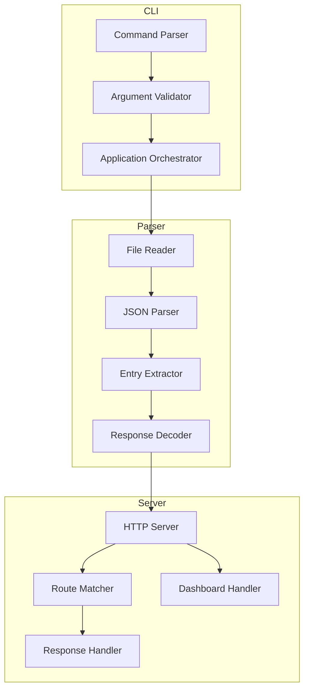

# Design Document

## Overview

har-proxy is a Node.js CLI tool that transforms HAR files into functional mock servers. The tool reads HAR files exported from Chrome DevTools, parses the HTTP request/response data, and creates a local HTTP server that replays the recorded responses when matching requests are received.

The system consists of three main components:
1. **CLI Module** - Handles command-line argument parsing and orchestrates the application
2. **HAR Parser** - Parses and transforms HAR file data into a usable format
3. **Mock Server** - Serves HTTP responses based on parsed HAR data and provides a dashboard

## Architecture



## Components and Interfaces

### 1. CLI Module (`src/cli.ts`)

Responsible for parsing command-line arguments and starting the application.

```typescript
interface CLIOptions {
  harFile: string;
  port: number;
  help: boolean;
  version: boolean;
}

function parseArgs(args: string[]): CLIOptions;
function run(options: CLIOptions): Promise<void>;
```

### 2. HAR Parser Module (`src/parser.ts`)

Parses HAR files and extracts endpoint data.

```typescript
interface HarEntry {
  method: string;
  url: string;
  path: string;
  queryString: QueryParam[];
  requestHeaders: Header[];
  status: number;
  responseHeaders: Header[];
  responseBody: string;
  contentType: string;
  timestamp: string;
}

interface QueryParam {
  name: string;
  value: string;
}

interface Header {
  name: string;
  value: string;
}

interface ParseResult {
  entries: HarEntry[];
  errors: string[];
}

function parseHarFile(filePath: string): Promise<ParseResult>;
function formatEntry(entry: HarEntry): string;
```

### 3. Mock Server Module (`src/server.ts`)

Creates and manages the HTTP mock server.

```typescript
interface ServerConfig {
  port: number;
  entries: HarEntry[];
}

interface EndpointMap {
  [key: string]: HarEntry; // key format: "METHOD:/proxy{path}"
}

const PROXY_PREFIX = '/proxy';

function createServer(config: ServerConfig): http.Server;
function buildEndpointMap(entries: HarEntry[]): EndpointMap;
function findMatchingEntry(method: string, path: string, map: EndpointMap): HarEntry | null;
function getProxyPath(originalPath: string): string; // Returns "/proxy" + originalPath
```

**Routing Strategy:**
- All HAR-recorded endpoints are prefixed with `/proxy` to avoid conflicts with internal routes
- Dashboard is served at `/` (internal route)
- HAR endpoints are served at `/proxy/*` (e.g., `/api/users` → `/proxy/api/users`)

### 4. Dashboard Module (`src/dashboard.ts`)

Generates the HTML dashboard for viewing endpoints.

```typescript
interface EndpointGroup {
  basePath: string;
  endpoints: EndpointInfo[];
}

interface EndpointInfo {
  method: string;
  path: string;
  status: number;
  contentType: string;
}

function generateDashboard(entries: HarEntry[]): string;
function groupEndpoints(entries: HarEntry[]): EndpointGroup[];
```

## Data Models

### HAR File Structure (Input)

The HAR file follows the standard HAR 1.2 specification:

```typescript
interface HarFile {
  log: {
    version: string;
    creator: { name: string; version: string };
    entries: HarLogEntry[];
  };
}

interface HarLogEntry {
  startedDateTime: string;
  request: {
    method: string;
    url: string;
    headers: { name: string; value: string }[];
    queryString: { name: string; value: string }[];
  };
  response: {
    status: number;
    headers: { name: string; value: string }[];
    content: {
      size: number;
      mimeType: string;
      text?: string;
      encoding?: string; // "base64" if encoded
    };
  };
}
```

### Internal Endpoint Registry

```typescript
interface EndpointRegistry {
  endpoints: Map<string, HarEntry>;
  
  register(entry: HarEntry): void;
  lookup(method: string, path: string): HarEntry | undefined;
  getAll(): HarEntry[];
}
```

## Correctness Properties

*A property is a characteristic or behavior that should hold true across all valid executions of a system-essentially, a formal statement about what the system should do. Properties serve as the bridge between human-readable specifications and machine-verifiable correctness guarantees.*

### Property 1: HAR Parsing Completeness

*For any* valid HAR file containing entries, the HAR_Parser SHALL extract all request data (method, URL, headers, query parameters) and all response data (status code, headers, body content) for every entry.

**Validates: Requirements 2.1, 2.2**

### Property 2: Base64 Decoding Round-Trip

*For any* string content, encoding it to base64 and then decoding it through the HAR_Parser SHALL produce the original string content.

**Validates: Requirements 2.3**

### Property 3: Entry Text Representation Round-Trip

*For any* valid HarEntry, generating its text representation and parsing it back SHALL produce an equivalent entry structure.

**Validates: Requirements 2.5**

### Property 4: Request-Response Matching

*For any* registered endpoint entry, sending an HTTP request with the same method and proxy-prefixed path (`/proxy` + original path) SHALL return the recorded response with matching status code.

**Validates: Requirements 3.1**

### Property 5: Unmatched Request Returns 404

*For any* HTTP request to `/proxy/*` where the method and path combination does not exist in the endpoint registry, the Mock_Server SHALL return a 404 status code.

**Validates: Requirements 3.2**

### Property 11: Proxy Path Prefix Consistency

*For any* HAR entry with path P, the endpoint SHALL be registered and accessible at `/proxy` + P, ensuring no conflicts with internal routes.

**Validates: Requirements 3.6**

### Property 6: Latest Entry Wins

*For any* sequence of entries with the same method and path, registering them in order SHALL result in the last entry being returned for matching requests.

**Validates: Requirements 3.3**

### Property 7: Response Fidelity

*For any* registered entry with headers and body content, the Mock_Server response SHALL include all recorded headers and the exact body content with correct content-type.

**Validates: Requirements 3.4, 3.5**

### Property 8: Dashboard Displays Complete Endpoint Info

*For any* set of registered entries, the generated dashboard HTML SHALL contain the method, proxy-prefixed path (`/proxy` + original path), status code, and content-type for every entry.

**Validates: Requirements 4.2, 4.3, 4.4**

### Property 9: Dashboard Groups by Base Path

*For any* set of entries, endpoints sharing the same base path (first path segment) SHALL be grouped together in the dashboard output.

**Validates: Requirements 4.5**

### Property 10: Endpoint Count Accuracy

*For any* set of loaded entries, the CLI SHALL display a count that exactly matches the number of unique method+path combinations.

**Validates: Requirements 5.3**

## Error Handling

### File System Errors
- **File not found**: Display clear error message with the attempted path
- **Permission denied**: Display error indicating insufficient permissions
- **File too large**: Consider implementing size limits with appropriate error messages

### Parsing Errors
- **Invalid JSON**: Catch JSON.parse errors and display line/column information if available
- **Invalid HAR structure**: Validate required fields and report missing/malformed data
- **Encoding errors**: Handle base64 decoding failures gracefully

### Server Errors
- **Port in use**: Detect EADDRINUSE and suggest alternative ports
- **Network errors**: Log connection issues without crashing the server

### Request Handling Errors
- **Malformed requests**: Return 400 Bad Request with descriptive message
- **Internal errors**: Return 500 with generic message, log details to console

## Testing Strategy

### Testing Framework

This project will use **Vitest** as the testing framework with **fast-check** for property-based testing.

### Unit Tests

Unit tests will cover:
- CLI argument parsing edge cases
- HAR file structure validation
- Individual utility functions
- Error message formatting

### Property-Based Tests

Property-based tests will verify the correctness properties defined above. Each property test:
- MUST run a minimum of 100 iterations
- MUST be tagged with a comment referencing the correctness property: `**Feature: har-proxy, Property {number}: {property_text}**`
- MUST use fast-check generators to produce random valid inputs

Key property tests:
1. **HAR Parsing Completeness** - Generate random HAR structures, verify all data is extracted
2. **Base64 Round-Trip** - Generate random strings, encode/decode, verify equality
3. **Entry Text Representation** - Generate entries, format/parse, verify equivalence
4. **Request-Response Matching** - Generate entries, register, request at `/proxy/*`, verify response
5. **404 for Unmatched** - Generate entries and non-matching requests to `/proxy/*`, verify 404
6. **Latest Entry Wins** - Generate duplicate entries, verify last one is returned
7. **Response Fidelity** - Generate entries with headers/body, verify exact match
8. **Dashboard Completeness** - Generate entries, verify all info including proxy paths in HTML output
9. **Dashboard Grouping** - Generate entries with shared base paths, verify grouping
10. **Endpoint Count** - Generate entries, verify displayed count matches
11. **Proxy Path Prefix** - Generate entries, verify all are accessible at `/proxy` + original path

### Integration Tests

Integration tests will verify:
- End-to-end flow from HAR file to running server
- Dashboard accessibility and content
- CLI help and version output

